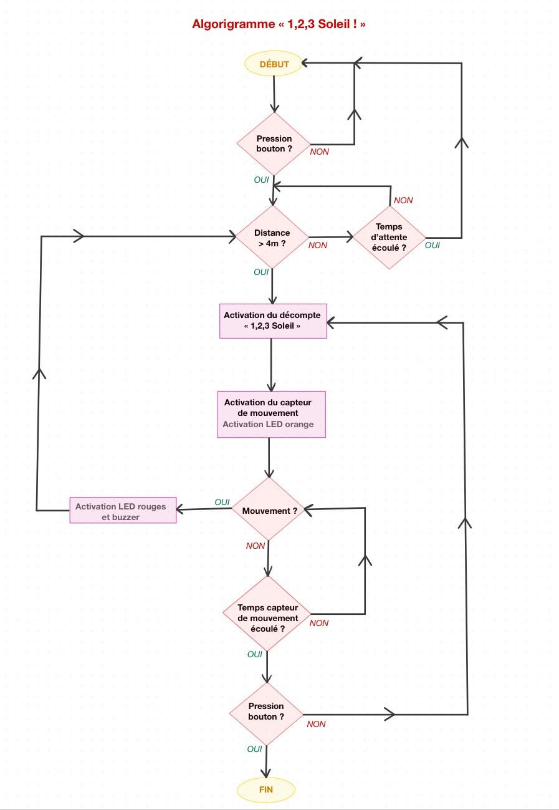
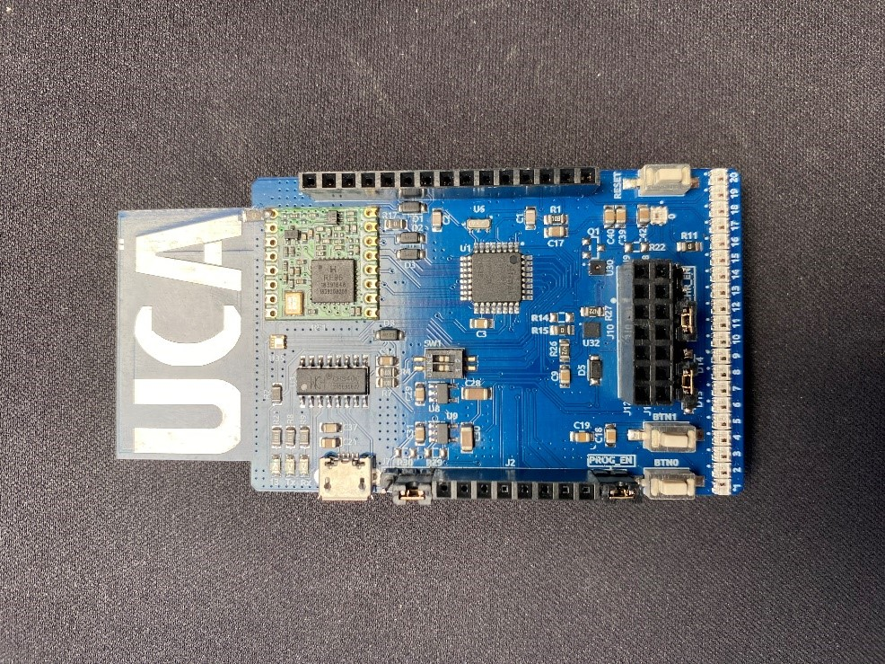
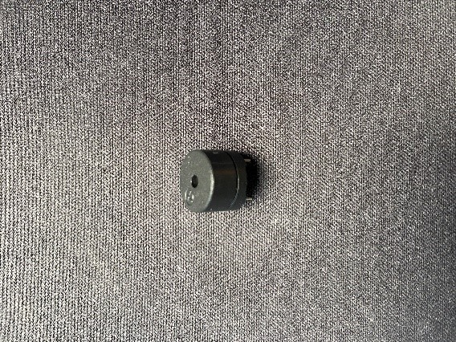
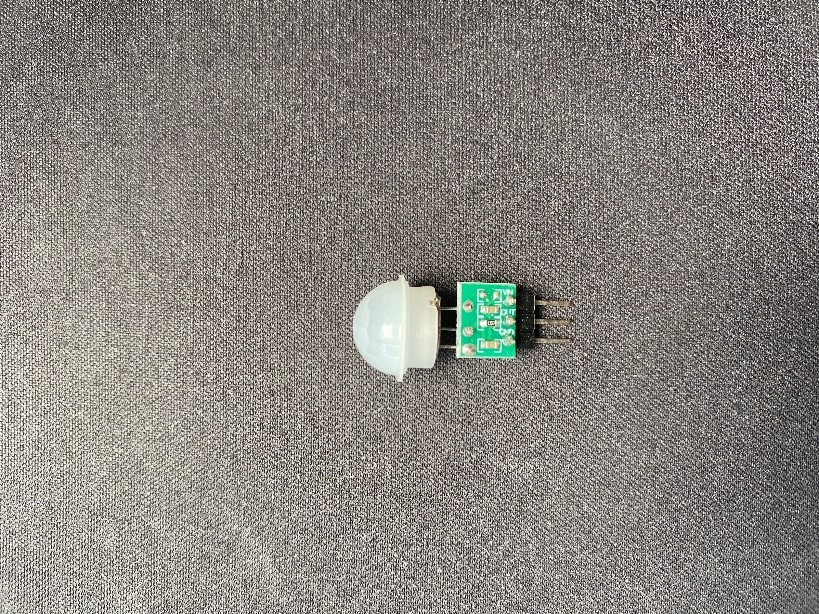
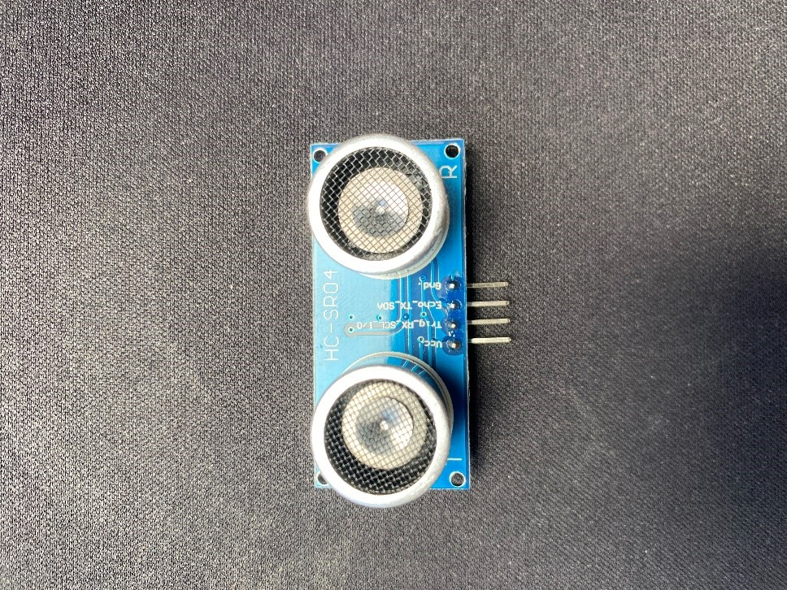

# « 1, 2, 3 ... Soleil ! »  
*Abdellah Imène, Sauvage Maïlys, Vixamar Clarah*

 

## Cadre du projet  
Ce projet a été réalisé dans le cadre de l’Unité d’Enseignement d’électronique **« Communication Sans Fil du terrestre au spatial »** proposé au campus Valrose de l’Université Côte-d’Azur et encadré par Ferrero Fabien, Lanteri Jérôme et Tombakdjian Lionel. Ce module vise à nous initier aux bases des technologies de communication sans fil à travers des apports théoriques et des travaux pratiques, incluant ce projet en équipe. Les objectifs pédagogiques couvrent l’électronique, la programmation, les protocoles de communication, la gestion de projet, l’usage de Git et la présentation orale des résultats.

## Qui sommes-nous ?  
Nous sommes Abdellah Imène, Sauvage Maïlys et Vixamar Clarah, étudiantes en troisième année de Licence Sciences et Technologies – Parcours Préparatoire au Professorat des Ecoles. Notre formation allie des enseignements de spécialisation en sciences et technologies dispensés au campus Valrose mais aussi des enseignements disciplinaires fondamentaux et de culture générale dispensés au lycée et à l’INSPE (Institut National Supérieur du Professorat et de l’Éducation) Liégeard. 
Nous avons donc toutes les trois l’objectif de devenir professeures des écoles et c’est cette volonté commune qui a motivé notre choix de projet.

 
 

## Quel est notre projet ?  

 

### Présentation du projet
Ce projet technologique intitulé **« 1,2,3… Soleil ! »** s’inscrit dans une démarche de conception d’outils éducatifs innovants, ludiques et inclusifs en lien avec notre futur métier d’enseignantes dans le premier degré. En effet, il nous tenait à cœur de concevoir un projet en lien avec les domaines de l’enfance, de l’école, du jeu. Notre objectif était double : proposer un outil ludique stimulant l’autonomie des enfants, et rendre le jeu accessible pour un enfant seul. Nous avons également souhaité réfléchir à un dispositif mobile et adapté à différents contextes d’utilisation (école, maison, centre de loisirs…).

L’idée de départ : moderniser un jeu traditionnel connu de tous (**1,2,3... Soleil**) en y intégrant une composante technologique. Le dispositif que nous avons conçu permet à un enfant de jouer à **« 1, 2, 3 ... Soleil »** grâce à un système électronique simple et intuitif. Grâce aux divers composants électroniques le constituant, le jeu détecte les déplacements, signale les fautes, et guide l’enfant tout au long de la partie. Ce projet nous a ainsi permis de combiner nos apprentissages en programmation et en électronique autour de la conception d’un jeu interactif mêlant **capteurs, buzzer et LEDs**.

 

### Fonctionnement global du dispositif 

### Matériel utilisé

Pour mener au mieux ce projet et que le jeu soit le plus adapté possible à ses conditions d’utilisation, nous avons utilisé le matériel suivant :  

- **Une carte électronique Lora 868 MHz** : Cette carte permet la communication sans fil longue portée entre les différents modules électroniques qu’on utilise. Dans notre projet, elle joue un rôle central en assurant la transmission des données entre les différentes parties du dispositif.

- **Un buzzer** : Il s’agit d’un petit dispositif sonore, similaire à un haut-parleur de faible puissance, qui produit un son en fonction de la fréquence et de l’amplitude des vibrations. Il permet de générer des notes et de simples mélodies.

- **Un détecteur de mouvement PIR** : Le capteur PIR permet de détecter un mouvement. Il est essentiellement constitué d’un capteur pyroélectrique capable de détecter les niveaux de rayonnement infrarouge.  Pour notre dispositif, il est utile lors des phases de détection, juste après le décompte du « 1, 2, 3 Soleil ! » quand l’enfant est censé être immobile. Le capteur nous permet identifier s’il y a eu un mouvement ou non et donc de contrôler le respect de la règle centrale du jeu.

- **Un capteur à ultrasons HC-SR04** : Ce type de capteur utilise le sonar pour déterminer la distance à un objet : l’émetteur (broche trig) envoie un signal, un son à haute fréquence. Lorsque le signal rencontre un objet, il est réfléchi et l’émetteur (broche echo) le reçoit. Ici, il nous sert lors de la première étape essentielle du programme pour permettre au dispositif de détecter la position de départ de l’enfant dans le jeu. Cette mesure est indispensable pour valider que l’enfant se trouve à la bonne distance soit à au moins 2 mètres et commencer la partie. En théorie, le capteur à ultrasons HC-SR04 a une distance de mesure allant de 2 cm à 400 cm. 

 

 

## Informations pratiques

### Installation dans l'IDE Arduino

1. Ouvrir l'IDE Arduino  
2. Aller dans **Fichier > Préférences**  
   Dans *"URL de gestionnaire de cartes supplémentaires"*, ajouter :  
   `https://rfthings.github.io/ArduinoBoardManagerJSON/package_rfthings-avr_index.json`  
3. Aller dans **Outils > Type de carte > Gestionnaire de cartes**  
   - Rechercher **RFThings AVR Boards**  
   - Installer le paquet  
4. Dans **Outils > Type de carte**, choisir :  
   - RFThings UCA  
   - Version : 3.9 and newer : AT328PB  
5. Sélectionner le bon Port COM  
6. Installer la librairie **FastLED** de Daniel Garcia  

 

### Branchements
- Buzzer 
A4         <----> + (patte + du buzzer) 
GND        <----> - (patte – du buzzer)

- Détecteur de mouvement (PIR) 
D5         <----> OUT  (signal de détection) 
5V         <----> VCC  (alimentation du capteur) 
GND        <----> GND  (masse)

- Capteur ultrasons (HC-SR04) 
D8         <----> TRIG (émission impulsion) 
D7         <----> ECHO (réception signal) 
5V         <----> VCC  (alimentation) 
GND        <----> GND  (masse)

 

#### Conseils de câblage :
- Le capteur PIR nécessite du 5V et GND pour fonctionner.
- Le buzzer n’a que 2 pattes : la patte marquée + doit aller vers A4, et l’autre vers GND.

 
 

## Remerciements 
Nous tenons à remercier nos enseignants pour leur accompagnement et leurs conseils tout au long du projet. Ce dernier nous a permis de mettre en pratique certains éléments appris au cours du semestre autour d’une réalisation concrète ayant du sens pour nous.
